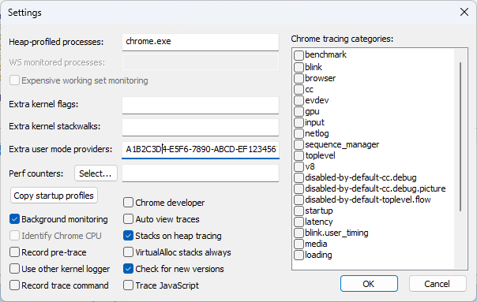
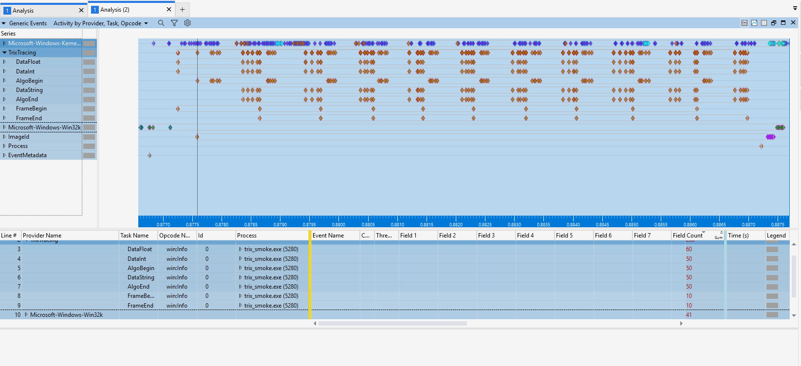

# ETW backend

ETW (Event Tracing for Windows) is the Windows kernel's built-in tracing
infrastructure. trix emits events via the **TraceLogging** API — a
self-describing format that requires no manifest registration. Events are
collected into a single `.etl` file alongside kernel data (CPU samples, context
switches, disk I/O, DPCs) and viewed in **Windows Performance Analyzer (WPA)**.

- [Requirements](#requirements)
- [Installing the tooling](#installing-the-tooling)
- [Capture](#capture)
  - [Option A — UIforETW GUI](#option-a--uiforetw-gui)
  - [Option B — etwrecord.bat](#option-b--etwrecordbat)
- [View in WPA](#view-in-wpa)


---

## Requirements

- Windows 10 or later
- **Windows Performance Toolkit (WPT)** — ships with the Windows SDK. Install
  via the Windows SDK installer and select "Windows Performance Toolkit" from
  the component list, or install the standalone WPT MSI.
- **UIforETW** — recommended wrapper that handles provider registration,
  buffer sizing, and symbol paths automatically.

---

## Installing the tooling

Download the latest `etwpackage_*.zip` from
<https://github.com/randomascii/UIforETW/releases/> and unzip it anywhere.
The `bin\` directory contains everything needed:

| File | Purpose |
|------|---------|
| `UIforETW.exe` | GUI front-end — recommended for interactive capture |
| `etwrecord.bat` | CLI capture script — useful for automation |
| `etwcommonsettings.bat` | Shared settings sourced by all capture scripts |
| `UserMarks.wpaProfile` | WPA layout preset optimised for user-mark events |

Run `bin\UIforETW.exe` once as Administrator to install WPT and set up symbol
paths. Subsequent captures do not require elevation.

---

## Capture

### Option A — UIforETW GUI

1. Open `UIforETW.exe`.
2. Click **Settings**.
3. In the **Extra user mode providers** field enter the TrixTracing GUID
   **without curly braces**:
   ```
   A1B2C3D4-E5F6-7890-ABCD-EF1234567890
   ```
4. Click **OK**.



5. Set the environment variable and launch your application:
   ```bat
   set TRIX_BACKEND=etw
   myapp.exe
   ```
6. In UIforETW click **Start tracing**, reproduce the frames you want to
   analyse, then click **Save trace buffers**.
7. WPA opens automatically on the resulting `.etl` file.

> **Note:** The GUID must be entered without `{` `}`. xperf (which UIforETW
> calls internally) rejects the brace-enclosed form for TraceLogging providers.

### Option B — etwrecord.bat

Edit `bin\etwcommonsettings.bat` and append the GUID to `CustomProviders`:

```bat
@set CustomProviders=Multi-MAIN+Multi-FrameRate+Multi-Input+Multi-Worker+A1B2C3D4-E5F6-7890-ABCD-EF1234567890
```

Then run from an **Administrator** command prompt:

```bat
etwrecord.bat
```

The script starts recording, pauses, and waits for a keypress. Run your
application (`set TRIX_BACKEND=etw`), reproduce the frames of interest, then press any key. The script
merges the kernel and user traces, saves an `.etl` file under
`%USERPROFILE%\Documents\etwtraces\`, and opens WPA automatically.

---

## View in WPA

WPA opens the `.etl` file with all kernel and user data in one timeline.

**Locate the trix events:**

1. In the **Graph Explorer** panel expand **System Activity → Generic Events**.
2. Drag **Generic Events** onto the analysis canvas.
3. In the table at the bottom, click the **Provider Name** column header to
   group by provider and locate **TrixTracing**.
4. Expand **TrixTracing** to see the individual event tasks:
   `FrameBegin`, `FrameEnd`, `AlgoBegin`, `AlgoEnd`, `DataInt`, `DataFloat`,
   `DataString`.



