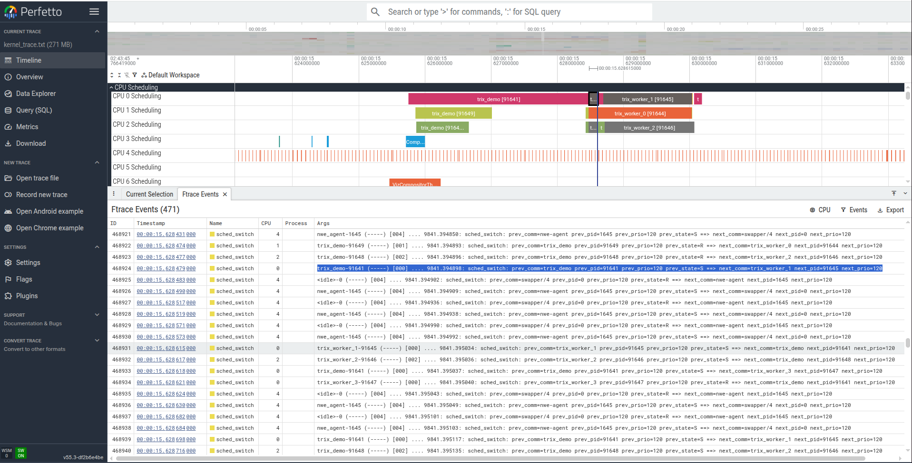
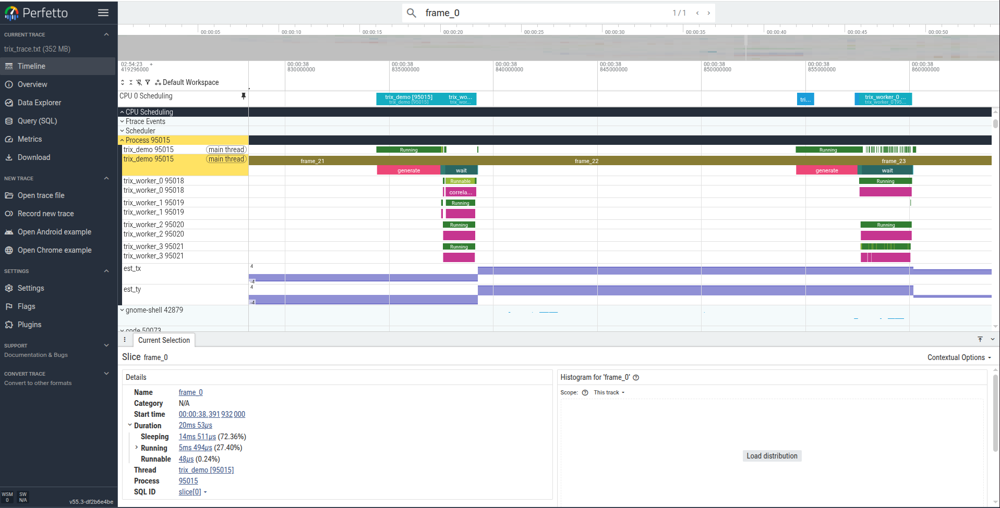

# ftrace backend

ftrace is the Linux kernel's built-in tracing infrastructure. trix writes events
to `trace_marker` using the **atrace/systrace wire format**, which Perfetto
renders as nested duration spans with full string names.

- [Kernel support](#kernel-support)
- [Verifying ftrace on the target](#verifying-ftrace-on-the-target)
- [Capture kernel events (no trix)](#capture-kernel-events-no-trix)
- [View in Perfetto](#view-in-perfetto)
- [Add trix events](#add-trix-events)
- [Capture scripts](#capture-scripts)
- [Wire format reference](#wire-format-reference)

---

## Kernel support

ftrace requires no packages — the tracer is part of the kernel.

### Ubuntu

All Ubuntu kernels ship with ftrace enabled. No action needed.

### Embedded / Yocto

Add a kernel config fragment to your layer. Create
`recipes-kernel/linux/linux-yocto/ftrace.cfg`:

```
# Core tracing infrastructure
CONFIG_TRACING_SUPPORT=y
CONFIG_FTRACE=y
CONFIG_NOP_TRACER=y
CONFIG_GENERIC_TRACER=y
CONFIG_RING_BUFFER=y
CONFIG_TRACE_CLOCK=y

# Scheduling events (sched_switch, sched_wakeup, sched_migrate_task)
CONFIG_SCHED_TRACER=y

# Syscall tracepoints (for syscall-level capture)
CONFIG_FTRACE_SYSCALLS=y
CONFIG_HAVE_SYSCALL_TRACEPOINTS=y
```

Then reference it from the recipe:

```bitbake
# in your linux-yocto bbappend:
SRC_URI += "file://ftrace.cfg"
```

For `tracefs` to be available at boot, add a mount entry. In a systemd-based
image this happens automatically. For a sysvinit image, add to `/etc/fstab`:

```
tracefs  /sys/kernel/tracing  tracefs  defaults  0 0
```

---

## Verifying ftrace on the target

### On a running system

Check that tracefs is mounted and `trace_marker` is accessible:

```bash
SUDO=${SUDO:-sudo}   # set SUDO="" if already root or inside a privileged container

# Is tracefs mounted?
mount | grep -E 'tracefs'

# Is trace_marker present?
$SUDO ls -la /sys/kernel/tracing/trace_marker

# Quick write test:
$SUDO sh -c 'echo test > /sys/kernel/tracing/trace_marker'
$SUDO grep test /sys/kernel/tracing/trace
```

If `trace_marker` is missing but the mount point exists, the kernel was built
without `CONFIG_FTRACE=y`.

If neither path exists, mount tracefs manually:

```bash
sudo mount -t tracefs nodev /sys/kernel/tracing
```

### Docker

ftrace works inside Docker — containers share the host kernel, so tracefs is
the same one the host uses. Two requirements:

1. The container must have write access to tracefs (privilege or capability + volume mount).
2. No `sudo` is needed — the default container user is root.

```bash
# Option A — privileged container (simplest):
docker run --privileged -it your-image bash

# Option B — minimal: only SYS_ADMIN capability + host tracefs mounted in:
docker run --cap-add SYS_ADMIN \
           -v /sys/kernel/tracing:/sys/kernel/tracing \
           -it your-image bash
```

> Option B requires tracefs to already be mounted on the **host**. The volume
> mount makes the host's tracefs visible inside the container but does not
> mount it from scratch.

Inside the container, set `SUDO=""` so the commands below work without
privilege escalation:

```bash
export SUDO=""
```

### From the filesystem only (image not running)

When you have a Yocto rootfs or image mounted on a host but the target is not
booted,/mage:

```bash
# If the image was built with CONFIG_IKCONFIG_PROC=y:
zcat /path/to/rootfs/proc/config.gz 2>/dev/null | grep -E 'CONFIG_FTRACE|CONFIG_TRACING'

# Otherwise look in /boot:
grep -E 'CONFIG_FTRACE|CONFIG_TRACING' /path/to/rootfs/boot/config-*

# Or directly in the Yocto kernel build directory:
grep -E 'CONFIG_FTRACE|CONFIG_TRACING' \
    tmp/work/<machine>/<kernel-recipe>/*/build/.config
```

The minimum required options are:

```
CONFIG_TRACING_SUPPORT=y
CONFIG_FTRACE=y
CONFIG_NOP_TRACER=y
```

`CONFIG_RING_BUFFER` and `CONFIG_TRACE_CLOCK` are auto-selected when the above
are set.

---

## Capture kernel events (no trix)

Before adding trix instrumentation, verify the full capture-and-view pipeline
works with plain kernel events: context switches and a few syscalls.

### Manual steps

```bash
SUDO=${SUDO:-sudo}   # set SUDO="" if already root or inside a privileged container
TRACE=/sys/kernel/tracing   # or /sys/kernel/debug/tracing on kernels < 4.1

# 1. Stop any running trace and clear the buffer
$SUDO sh -c "echo 0 > $TRACE/tracing_on"
$SUDO sh -c "echo    > $TRACE/trace"
$SUDO sh -c "echo nop > $TRACE/current_tracer"

# 2. Set buffer size (per CPU, in KB)
$SUDO sh -c "echo 8192 > $TRACE/buffer_size_kb"

# 3. Enable events
$SUDO sh -c "echo 1 > $TRACE/events/sched/sched_switch/enable"
$SUDO sh -c "echo 1 > $TRACE/events/sched/sched_wakeup/enable"
$SUDO sh -c "echo 1 > $TRACE/events/sched/sched_migrate_task/enable"

# Optional: specific syscalls
$SUDO sh -c "echo 1 > $TRACE/events/syscalls/sys_enter_read/enable"
$SUDO sh -c "echo 1 > $TRACE/events/syscalls/sys_enter_write/enable"

# 4. Start tracing
$SUDO sh -c "echo 1 > $TRACE/tracing_on"

# 5. Run the target application (or just sleep)
./trix_demo

# 6. Stop and save
$SUDO sh -c "echo 0 > $TRACE/tracing_on"
$SUDO cat $TRACE/trace > kernel_trace.txt

# 7. Disable events
$SUDO sh -c "echo 0 > $TRACE/events/sched/sched_switch/enable"
$SUDO sh -c "echo 0 > $TRACE/events/sched/sched_wakeup/enable"
$SUDO sh -c "echo 0 > $TRACE/events/sched/sched_migrate_task/enable"
$SUDO sh -c "echo 0 > $TRACE/events/syscalls/sys_enter_read/enable"
$SUDO sh -c "echo 0 > $TRACE/events/syscalls/sys_enter_write/enable"
```

### Filter to one process (optional)

To reduce noise when only one application is of interest:

```bash
SUDO=${SUDO:-sudo}   # set SUDO="" if already root or inside a privileged container

# Capture the PID before tracing starts, then filter
echo $MY_APP_PID | $SUDO tee /sys/kernel/tracing/set_ftrace_pid

# Or launch the app and filter simultaneously:
$SUDO sh -c "echo 1 > /sys/kernel/tracing/tracing_on"
./myapp &
APP_PID=$!
echo $APP_PID | $SUDO tee /sys/kernel/tracing/set_ftrace_pid
wait $APP_PID
$SUDO sh -c "echo 0 > /sys/kernel/tracing/tracing_on"
```

Remove the filter afterwards:

```bash
$SUDO sh -c "echo > /sys/kernel/tracing/set_ftrace_pid"
```

### Raw trace format

```
# tracer: nop
#
#                              _-----=> irqs-off
#                             / _----=> need-resched
#           TASK-PID    CPU#  ||  |||    TIMESTAMP  FUNCTION
#              | |        |   ||  |||       |           |
         myapp-1234   [002] d... 1042.001234: sched_switch: prev_comm=myapp ...
         myapp-1234   [002] d... 1042.001280: sys_enter_write: fd: 1 ...
      kworker-89      [000] d... 1042.001310: sched_wakeup: comm=myapp pid=1234 ...
```

Each line: process name, PID, CPU, flags, timestamp (seconds), event name, arguments.

---

## View in Perfetto

Perfetto reads the raw ftrace text file natively — no conversion needed.

1. Open **https://ui.perfetto.dev** in browser (or use instructions from  [perfetto](../viewers/perfetto))
2. Click **Open trace**
3. Drag and drop `kernel_trace.txt`

Perfetto shows:
- A CPU lane per logical core — coloured bars showing which thread ran where
- A thread lane per process — context-switch transitions visible as gaps

To see the per-thread spans in the lower pane, expand the ftrace events group:
in the left sidebar check **[...]** → **[x] ftrace events**.



---

## Add trix events

### Build with the ftrace backend

ftrace is enabled by default on Linux. Build normally:

```bash
cmake -B build
cmake --build build
```

Link your application against `libtrix.so` and define `TRIX_ENABLED`:

```cmake
find_package(Trix REQUIRED)
target_link_libraries(myapp PRIVATE Trix::trix)
target_compile_definitions(myapp PRIVATE TRIX_ENABLED)
```

### Capture with trix

The manual steps are identical to the kernel-only capture above.
Set `TRIX_BACKEND=ftrace` before running your application:

```bash
SUDO=${SUDO:-sudo}   # set SUDO="" if already root or inside a privileged container
TRACE=/sys/kernel/tracing

$SUDO sh -c "echo 0 > $TRACE/tracing_on"
$SUDO sh -c "echo    > $TRACE/trace"
$SUDO sh -c "echo nop > $TRACE/current_tracer"
$SUDO sh -c "echo 8192 > $TRACE/buffer_size_kb"

$SUDO sh -c "echo 1 > $TRACE/events/sched/sched_switch/enable"
$SUDO sh -c "echo 1 > $TRACE/events/sched/sched_wakeup/enable"
$SUDO sh -c "echo 1 > $TRACE/events/sched/sched_migrate_task/enable"

$SUDO sh -c "echo 1 > $TRACE/tracing_on"

$SUDO env TRIX_BACKEND=ftrace LD_LIBRARY_PATH=./build ./build/demo/trix_demop

$SUDO sh -c "echo 0 > $TRACE/tracing_on"
$SUDO cat $TRACE/trace > trix_trace.txt

$SUDO sh -c "echo 0 > $TRACE/events/sched/sched_switch/enable"
$SUDO sh -c "echo 0 > $TRACE/events/sched/sched_wakeup/enable"
$SUDO sh -c "echo 0 > $TRACE/events/sched/sched_migrate_task/enable"
```

Or use the provided scripts — they handle all of the above:

```bash
# 1. Start tracing
sudo sh ./scripts/capture_ftrace_pre.sh

# 2. Run your application (in this shell or another)
./your_app
# or with trix ftrace backend:
TRIX_BACKEND=ftrace LD_LIBRARY_PATH=$PWD/build ./your_app

# 3. Stop and save
sudo sh ./scripts/capture_ftrace_post.sh
```

The scripts also work without trix: omit `TRIX_BACKEND` and only the kernel
scheduling events are captured.

The output file is named `trix_ftrace_YYYYMMDD_HHMMSS.txt` by default.
Override with `TRIX_FTRACE_OUT`:

```bash
TRIX_FTRACE_OUT=my_trace.txt sudo sh ./scripts/capture_ftrace_post.sh
```

### Verify trix events are in the trace

When trix initialises it prints a one-line summary to stderr:

```
trix 1.1.0  TRIX_BACKEND=ftrace    available=[ftrace perf itt atrace ]
```

This confirms which backend is active and which were compiled into the library.
Set `TRIX_QUIET=1` to suppress the line:

```bash
TRIX_QUIET=1 TRIX_BACKEND=ftrace LD_LIBRARY_PATH=$PWD/build ./myapp
```

To verify events reached the trace file:

```bash
# Count trix trace_marker writes
grep -c tracing_mark_write trix_trace.txt
```

If `grep -c tracing_mark_write` returns zero:
- Check that `TRIX_BACKEND=ftrace` was set when running the application
- Check that `libtrix.so` was found: `ldd ./myapp | grep trix`
- Check that `TRIX_ENABLED` was defined at compile time: `nm ./myapp | grep trix_frame_begin`

To watch trix events in real time while the application runs (without saving to
a file):

```bash
sudo cat /sys/kernel/tracing/trace_pipe | grep tracing_mark_write
```

### View trix trace in Perfetto

Drag and drop `trix_trace.txt` into Perfetto. trix events appear as:

- **Duration spans** per thread (`frame_0`, `encode`, …) — one row per thread,
  nested inside each other according to the `TRIX_FRAME_SCOPE` / `TRIX_ALGO_SCOPE`
  nesting in your code
- **Counter tracks** below each thread row for `TRIX_DATA_INT` and
  `TRIX_DATA_FLOAT` values
- String data (`TRIX_DATA_STRING`) appears as zero-duration spans named
  `key=value`

The scheduling events captured alongside trix events show context switches as
gaps in the span tracks and fill the CPU lanes at the top of the trace.

The trix spans are in the **Processes** section, below the CPU lanes — scroll
down past `CPU 0 … CPU N` to find the `trix_demo` process group and expand it.
To jump straight to the first frame span, press **Ctrl+F** and search for
`frame_0`.



---

## Capture scripts

| Script | Purpose |
|--------|---------|
| `scripts/capture_ftrace_pre.sh` | Configure tracefs, enable sched events, start tracing |
| `scripts/capture_ftrace_post.sh` | Stop tracing, save trace file, disable events |

### Environment variables

| Variable | Default | Description |
|----------|---------|-------------|
| `TRIX_BACKEND` | `ftrace` | Backend forwarded to the command |
| `TRIX_BUFFER_KB` | `8192` | Per-CPU ring-buffer size in KB |
| `TRIX_FTRACE_OUT` | `trix_ftrace_YYYYMMDD_HHMMSS.txt` | Output file path |
| `LD_LIBRARY_PATH` | (current value) | Forwarded to the command |

---

## Wire format reference

trix writes to `trace_marker` using the atrace/systrace format:

| Event | Format | Emitted by |
|-------|--------|-----------|
| Span begin | `B|<pid>|<name>\n` | `TRIX_FRAME_BEGIN`, `TRIX_ALGO_BEGIN` |
| Span end | `E|<pid>\n` | `TRIX_FRAME_END`, `TRIX_ALGO_END` |
| Counter | `C|<pid>|<key>|<value>\n` | `TRIX_DATA_INT`, `TRIX_DATA_FLOAT` |
| String | `B|<pid>|<key>=<value>\n` + `E|<pid>\n` | `TRIX_DATA_STRING` |

The kernel timestamps each write with the writing thread's TID and a
nanosecond-resolution clock. `E` events are matched to the most recent `B`
event on the same thread (LIFO stack), so nested spans work correctly across
any depth.

Frame numbers appear in the span name: `frame_0`, `frame_1`, etc. The frame
number is not stored separately — it is embedded in the `B` event name.

---

## trace-cmd

`trace-cmd` is the standard user-space front-end for ftrace. Instead of
manually writing to tracefs files, a single `trace-cmd record` command sets up
the buffer, enables events, runs the target, and saves everything to a binary
`.dat` file.

There are two workflows depending on what viewer you use:

| Workflow | Output | Viewer |
|---|---|---|
| `trace-cmd` → KernelShark | `.dat` (native) | KernelShark |
| Raw tracefs commands | `.txt` (native) | Perfetto |

> **Perfetto and the ftrace text format:** Perfetto's support for the ftrace
> textual format is primarily for legacy compatibility and is maintained on a
> best-effort basis. For best results use the raw tracefs workflow when
> targeting Perfetto.

### Install

```bash
sudo apt install trace-cmd
```

**Verify**

```bash
trace-cmd version
```

### `.dat` vs `.txt`

`trace-cmd record` always produces a binary `.dat` file. It is compact,
includes metadata (CPU topology, event format strings, clock source), and is
the native input for KernelShark.

`.txt` is plain text in the same format as `/sys/kernel/tracing/trace`. It is
human-readable and the format Perfetto accepts.

| | `.dat` | `.txt` |
|---|---|---|
| Produced by | `trace-cmd record` | `trace-cmd report`, manual `cat trace` |
| Size | Smaller (binary) | Larger (text) |
| KernelShark | ✔ native | ✘ |
| Perfetto | ✘ | ✔ (best-effort) |
| Human-readable | ✘ | ✔ |

### Record with trace-cmd

**Single command (records until the app exits):**

```bash
sudo trace-cmd record -e sched:sched_switch -e sched:sched_wakeup \
    -e sched:sched_migrate_task \
    -- env TRIX_BACKEND=ftrace LD_LIBRARY_PATH=$PWD/build \
       $PWD/build/demo/trix_demo
```

**Separate start / stop (useful when the app is already running):**

```bash
# 1. Start tracing
sudo trace-cmd start -e sched:sched_switch -e sched:sched_wakeup \
    -e sched:sched_migrate_task

# 2. Run your application (sudo env passes env vars through sudo)
sudo env TRIX_BACKEND=ftrace LD_LIBRARY_PATH=$PWD/build $PWD/build/demo/trix_demo

# 3. Stop and save to trace.dat
sudo trace-cmd stop
sudo trace-cmd extract
```

Both approaches produce `trace.dat` in the current directory.

### Convert `.dat` to `.txt`

To open a trace in Perfetto, convert the binary `.dat` to text. `trace-cmd
report` wraps trix events as `print: tracing_mark_write: ...` but Perfetto
expects `tracing_mark_write: ...` directly — strip the prefix with `sed`:

```bash
trace-cmd report trace.dat \
  | sed 's/: print: *tracing_mark_write:/: tracing_mark_write:/' \
  > trace.txt
```

Then drag and drop `trace.txt` into [Perfetto](https://ui.perfetto.dev) as usual.

### View in KernelShark

KernelShark reads `.dat` files directly — no conversion needed:

```bash
kernelshark trace.dat
```

> Full KernelShark usage is covered in [viewers/kernelshark](../viewers/kernelshark.md).
