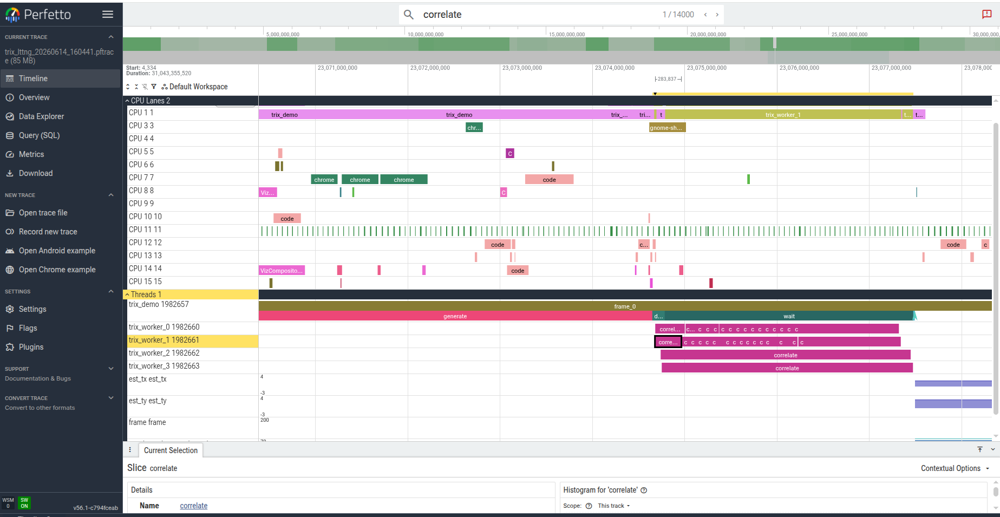

# lttng backend

LTTng (Linux Trace Toolkit: next generation) is a high-performance tracing framework
for Linux. trix emits structured **CTF** (Common Trace Format) events via LTTng-UST
(user-space tracepoints), collected by the LTTng session daemon with nanosecond timestamps.

Unlike ftrace, LTTng-UST events are typed and schema-defined — each trix tracepoint
carries its arguments as named fields, not an unstructured string. The CTF binary format
is compact, low-overhead, and can be viewed in Trace Compass without conversion.

- [Install](#install)
- [Verify](#verify)
- [Manual capture](#manual-capture)
- [Capture with context switches](#capture-with-context-switches)
- [Capture scripts](#capture-scripts)

---

## Install

```bash
sudo apt install lttng-tools liblttng-ust-dev babeltrace2
```

| Package | Role |
|---------|------|
| `lttng-tools` | `lttng` CLI, `lttng-sessiond` session daemon |
| `liblttng-ust-dev` | Build-time dependency for `libtrix.so` (UST tracepoints) |
| `babeltrace2` | Convert CTF traces to text; required by `capture_lttng_post.sh` |

**Verify the installation:**

```bash
lttng --version
```

```
lttng (LTTng Trace Control) 2.13.4 - Nordicité
```

---

## Verify

**1. LTTng user-space tools installed and working:**

```bash
lttng --version
```
Expected: `lttng (LTTng Trace Control) 2.x.x`

**2. LTTng kernel module installed (optional — needed for context switches):**

```bash
dpkg -l lttng-modules-dkms
sudo lttng list -k | head -3
```

If not installed:
```bash
sudo apt install lttng-modules-dkms
```

**3. trix compiled with the lttng backend:**

```bash
LD_LIBRARY_PATH=$PWD/build ./build/smoke/trix_smoke 2>&1 | head -1
```

Expected: `trix x.x.x  TRIX_BACKEND=none  available=[... lttng ...]`

If `lttng` is missing from the list, `liblttng-ust-dev` was not installed
before building — reinstall it and rebuild:
```bash
sudo apt install liblttng-ust-dev
cmake -B build && cmake --build build
```

---

## Manual capture

```bash
# 1. Create a session
lttng create trix_session --output=/tmp/trix_session

# 2. Enable all trix tracepoints and add context fields
lttng enable-event -u 'trix:*'
lttng add-context -u -t vpid -t vtid -t procname

# 3. Start, run your application, stop
lttng start
TRIX_BACKEND=lttng LD_LIBRARY_PATH=$PWD/build ./your_app
lttng stop

# 4. Destroy the session when done
lttng destroy trix_session
```

After stopping you have two options:

**Text** — view directly in the terminal or export with babeltrace2:

```bash
lttng view                                          # pipes through babeltrace2
babeltrace2 /tmp/trix_session > trix_lttng.txt      # save to file
```

**GUI** — import the CTF directory in Trace Compass:

```
File → Import → Select root directory → /tmp/trix_session
```


Selecting a `trix:algo_begin` / `trix:algo_end` pair in the Events Editor shows
the span boundaries and fields in the detail pane:


See [View in Trace Compass](#view-in-trace-compass) for details, or
[Convert to Perfetto](#convert-to-perfetto) for the Perfetto UI.

---

## Capture with context switches

Adding kernel scheduling events (`sched_switch`, `sched_wakeup`) alongside
UST tracepoints lets Trace Compass populate the **Control Flow** view — a
per-thread timeline showing exactly when each thread ran and on which CPU.

### Requirements

```bash
sudo apt install lttng-modules-dkms
```

The kernel module must be loaded (happens automatically after install or reboot):

```bash
sudo modprobe lttng-tracer
```

### Capture

Run `lttng-sessiond` and all `lttng` commands as root so the kernel channel is
accessible:

```bash
sudo lttng create trix_session --output=/tmp/trix_session

# UST: trix tracepoints
sudo lttng enable-event -u 'trix:*'
sudo lttng add-context -u -t vpid -t vtid -t procname

# Kernel: scheduling events
sudo lttng enable-event -k sched_switch
sudo lttng enable-event -k sched_wakeup

sudo lttng start
sudo env TRIX_BACKEND=lttng LD_LIBRARY_PATH=$PWD/build ./your_app
sudo lttng stop

sudo lttng destroy trix_session
```

### View in Trace Compass

Import `/tmp/trix_session` as before. With kernel events present, the
**Control Flow** view now shows thread scheduling lanes — trix UST events
appear in the Events Editor filtered to the thread of interest.


Trace Compass auto-creates an **experiment** when it finds both `kernel/` and
`ust/` under the same session root, merging their timestamps into one view:

- **Control Flow** — per-thread scheduling lanes (which CPU, when preempted/woken)
- **Events Editor** — all kernel + UST events interleaved by timestamp
- **Time-synchronized** — clicking a `trix:algo_begin` row jumps the Control Flow
  view to that exact moment and highlights the owning thread

> UST trix events don't appear as coloured spans inside the Control Flow lanes
> (that requires a custom XML state analysis). For proper nested span
> visualization alongside scheduling context, use
> [Convert to Perfetto](#convert-to-perfetto) instead.

### View in Perfetto

Convert the babeltrace2 text export and open in Perfetto to see both trix spans
and CPU scheduling context in the same view:

```bash
babeltrace2 /tmp/trix_session > trix_lttng.txt
python3 scripts/lttng_to_perfetto.py trix_lttng.txt -o trix_lttng.pftrace
```

Open `trix_lttng.pftrace` at **https://ui.perfetto.dev**. The trace contains
two process groups: **Threads** (trix spans, nested by frame/algo) and **CPU
Lanes** (one row per CPU, showing which thread ran when).



---

## Capture scripts

The two scripts automate the manual steps above.

| Script | Purpose |
|--------|---------|
| `scripts/capture_lttng_pre.sh` | Start `lttng-sessiond`, create session, enable `trix:*`, add context, optionally enable kernel sched events, start tracing |
| `scripts/capture_lttng_post.sh` | Stop session, export CTF → text with `babeltrace2`, destroy session |

### Usage

```bash
# UST only (no root needed)
sh ./scripts/capture_lttng_pre.sh

# UST + kernel sched events (sched_switch, sched_wakeup)
sudo sh ./scripts/capture_lttng_pre.sh

# 2. Run your application (one or more times)
TRIX_BACKEND=lttng LD_LIBRARY_PATH=$PWD/build ./your_app

# 3. Stop and save
sh ./scripts/capture_lttng_post.sh
```

When run as root the script attempts to enable kernel `sched_switch` and
`sched_wakeup` events automatically. If `lttng-modules-dkms` is not installed
it prints a warning and continues with UST events only:

```
  kernel events: unavailable — install lttng-modules-dkms and reboot:
    sudo apt install lttng-modules-dkms
```

To suppress the kernel step even when running as root:

```bash
TRIX_LTTNG_NO_KERNEL=1 sudo sh ./scripts/capture_lttng_pre.sh
```

Output is saved to `trix_lttng_YYYYMMDD_HHMMSS.txt` in the current directory.
Override with `TRIX_LTTNG_OUT`:

```bash
TRIX_LTTNG_OUT=my_trace.txt sh ./scripts/capture_lttng_post.sh
```

Override the session name with `TRIX_SESSION_NAME`:

```bash
TRIX_SESSION_NAME=my_session sh ./scripts/capture_lttng_pre.sh
```

### Convert to Perfetto after capture

```bash
python3 scripts/lttng_to_perfetto.py trix_lttng_YYYYMMDD_HHMMSS.txt \
    -o trix_lttng.pftrace
```

Then open `trix_lttng.pftrace` at **https://ui.perfetto.dev**.

---
