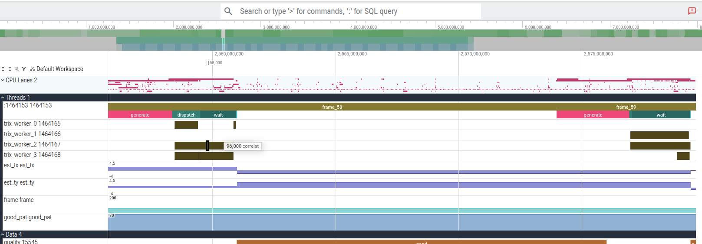

# perf backend

The perf backend uses **SDT (Statically Defined Tracing)** probes — NOP
instructions compiled into `libtrix.so` that perf patches at runtime with zero
overhead when not active. No kernel module or root access is required for
user-mode recording (with `perf_event_paranoid ≤ 1`).

Traces are converted to Perfetto format for visualisation.

- [Requirements](#requirements)
- [Verifying perf on the target](#verifying-perf-on-the-target)
- [Capture with trix](#capture-with-trix)
- [View in Perfetto](#view-in-perfetto)
- [Capture scripts](#capture-scripts)
- [String pointer note](#string-pointer-note)

---

## Requirements

### Install perf

```bash
# Ubuntu / Debian
sudo apt install linux-perf
# or for the exact running kernel:
sudo apt install linux-tools-$(uname -r)

# Fedora / RHEL
sudo dnf install perf
```

Verify:

```bash
perf --version
```

### perf_event_paranoid

```bash
# Check current value
cat /proc/sys/kernel/perf_event_paranoid

# Allow user-mode recording (until next reboot)
echo 1 | sudo tee /proc/sys/kernel/perf_event_paranoid

# Persist across reboots
echo 'kernel.perf_event_paranoid = 1' | sudo tee /etc/sysctl.d/10-perf.conf
sudo sysctl -p /etc/sysctl.d/10-perf.conf
```

| Value | Meaning |
|-------|---------|
| `-1` | No restrictions |
| `0` | No restrictions for normal users |
| `1` | CPU counters and tracepoints allowed (minimum for perf record) |
| `2` | Only root can use perf |
| `3` | (default on Ubuntu 20.04+) root only |

---

## Verifying perf on the target

```bash
# Quick self-test — record a 1-second sleep
perf stat sleep 1

# List available SDT probes after registering libtrix.so
perf buildid-cache --add ./build/libtrix.so
perf list sdt | grep trix
```

Expected probe list after registration:

```
sdt_trix:algo_begin
sdt_trix:algo_end
sdt_trix:frame_begin
sdt_trix:frame_end
sdt_trix:data_int
sdt_trix:data_float
sdt_trix:data_string
```

---

## Capture with trix

### Build with the perf backend

The perf backend is enabled by default on Linux. Build normally:

```bash
cmake -B build
cmake --build build
```

Link your application against `libtrix.so` and define `TRIX_ENABLED`:

```cmake
find_package(Trix REQUIRED)
target_link_libraries(myapp PRIVATE Trix::trix)
target_compile_definitions(myapp PRIVATE TRIX_ENABLED)
```

### Manual capture

```bash
SUDO=${SUDO:-sudo}   # set SUDO="" if already root

# 1. Register SDT probes and start recording (system-wide, background)
$SUDO sh ./scripts/capture_perf_pre.sh

# 2. Run your application
TRIX_BACKEND=perf LD_LIBRARY_PATH=$PWD/build ./build/demo/trix_demo

# 3. Stop recording and export (sudo needed — perf data is root-owned)
$SUDO sh ./scripts/capture_perf_post.sh
```

Or manually:

```bash
# Register probes (sudo needed)
sudo perf buildid-cache --add ./build/libtrix.so
sudo perf probe --del 'sdt_trix:*' 2>/dev/null || true
for probe in algo_begin algo_end frame_begin frame_end data_int data_float data_string; do
    sudo perf probe -x ./build/libtrix.so "sdt_trix:${probe}"
done

# Start recording system-wide in background
sudo perf record -a \
    -e sdt_trix:algo_begin \
    -e sdt_trix:algo_end \
    -e sdt_trix:frame_begin \
    -e sdt_trix:frame_end \
    -e sdt_trix:data_int \
    -e sdt_trix:data_float \
    -e sdt_trix:data_string \
    -e sched:sched_switch \
    -o trix_perf.data &
PERF_PID=$!

# Run your application
TRIX_BACKEND=perf LD_LIBRARY_PATH=$PWD/build ./build/demo/trix_demo

# Stop recording
sudo kill -INT $PERF_PID

# Export to text
sudo perf script -i trix_perf.data \
    -F comm,tid,cpu,time,event,trace \
    --show-mmap-events \
    > trix_perf.txt
```

### Verify trix events are recorded

When trix initialises it prints to stderr:

```
trix 1.2.0  TRIX_BACKEND=perf      available=[ftrace perf itt lttng atrace ]
```

To confirm probes fired:

```bash
grep -c sdt_trix trix_perf.txt
```

---

## View in Perfetto

Convert the text trace to Perfetto format and open in the UI:

```bash
python3 scripts/perf_to_perfetto.py trix_perf.txt -o trix_perf.pftrace
```

Then open **https://ui.perfetto.dev** and drag and drop `trix_perf.pftrace`.

The trace shows:
- **Thread spans** — `frame_0`, `frame_1`, nested algo spans per thread
- **CPU lanes** — context switches from `sched:sched_switch`
- **Counter tracks** — `data_int` / `data_float` values

> **Note:** String arguments (algo names, counter keys) appear as `algo_0`, `algo_1`, `ctr_0`, `ctr_1`, etc.
> SDT probes record only the pointer value, not the string content.
> `perf_to_perfetto.py` assigns sequential indices to each unique pointer seen at runtime.



---

## Capture scripts

| Script | Purpose |
|--------|---------|
| `scripts/capture_perf_pre.sh` | Register SDT probes, start `perf record -a` in background |
| `scripts/capture_perf_post.sh` | Stop recording, export `.data` → `.txt`, print converter hint |

### Environment variables

| Variable | Default | Description |
|----------|---------|-------------|
| `TRIX_BACKEND` | `perf` | Backend forwarded to the command |
| `LD_LIBRARY_PATH` | (current value) | Forwarded to the command |
| `TRIX_PERF_OUT` | `trix_perf_YYYYMMDD_HHMMSS.txt` | Output text file path |
| `TRIX_LIB` | auto-detected | Path to `libtrix.so` for probe registration |

---

## String pointer note

The perf backend records **pointers** to string arguments, not the string content
itself. In the exported trace, algo names appear as pointer addresses
(e.g. `arg1=0x401a20`) rather than strings like `"encode"`.

`perf_to_perfetto.py` handles this automatically:
- Assigns stable short names (`algo_0`, `algo_1`, …) to each unique pointer
- Prints a legend mapping `algo_N → 0xADDR` to stdout

To resolve the addresses to actual names manually:

```bash
strings ./build/demo/trix_demo | grep -E 'encode|decode|render'
# or
nm ./build/demo/trix_demo | grep -i rodata
```

Frame numbers are recorded as integer values and appear correctly as
`frame_0`, `frame_1`, etc. — no pointer issue.
