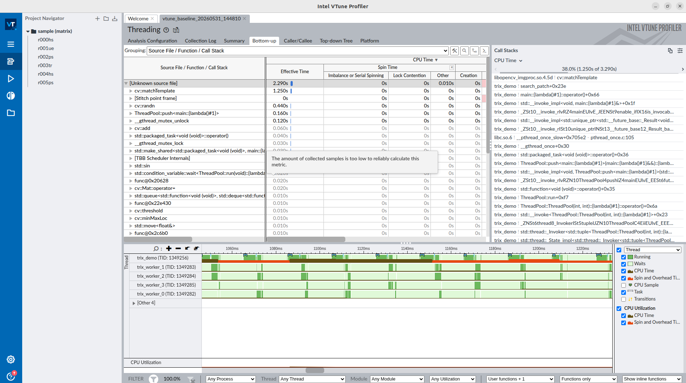
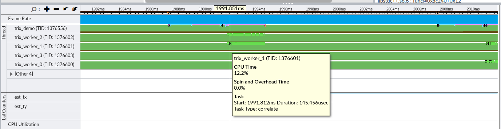
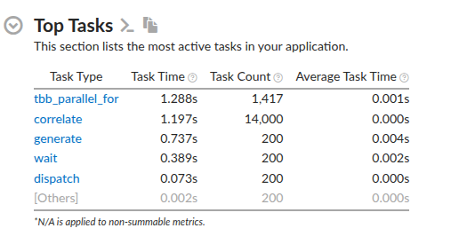
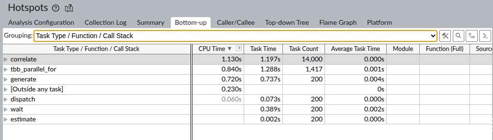
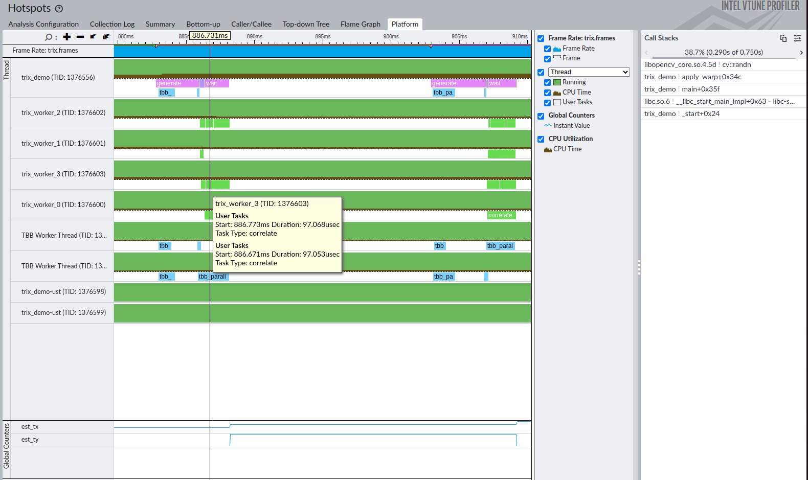

# VTune / ITT backend

Intel VTune Profiler uses the **ITT API** (Instrumentation and Tracing Technology)
to collect named task spans with nanosecond timestamps, thread context switches,
CPU samples, and user-defined counters — all correlated on a single timeline.

trix ships the ittapi source compiled directly into `libtrix.so`. No separate
ittapi installation is needed. If VTune is not running, all ITT calls are
no-ops: zero overhead, no errors.

- [Requirements](#requirements)
- [Verifying VTune on the target](#verifying-vtune-on-the-target)
- [Capture without trix](#capture-without-trix)
- [View in VTune GUI](#view-in-vtune-gui)
- [Add trix events](#add-trix-events)
- [Capture scripts](#capture-scripts)

---

## Requirements

### Install VTune Profiler

VTune Profiler is free (no licence needed for the threading analysis used here).

```bash
# Option A — Intel oneAPI Base Toolkit (includes VTune):
# https://www.intel.com/content/www/us/en/developer/tools/oneapi/base-toolkit.html

# Option B — standalone VTune Profiler:
# https://www.intel.com/content/www/us/en/developer/tools/oneapi/vtune-profiler.html

# After install, source the environment:
source /opt/intel/oneapi/setvars.sh
# or if installed on home directory:
source ~/intel/oneapi/setvars.sh

```

Verify the binary is available:

```bash
vtune --version
```

### ptrace scope

VTune needs `ptrace_scope = 0` to attach to target processes (it's safe in personal dev workstation):

```bash
# Check current value
cat /proc/sys/kernel/yama/ptrace_scope

# Set to 0 (until next reboot)
echo 0 | sudo tee /proc/sys/kernel/yama/ptrace_scope

# Persist across reboots
echo 'kernel.yama.ptrace_scope = 0' | sudo tee /etc/sysctl.d/10-ptrace.conf
sudo sysctl -p /etc/sysctl.d/10-ptrace.conf
```

---

## Verifying VTune on the target

### Quick self-test

```bash
# Run VTune's own built-in self-check
vtune-self-checker.sh

# List available analysis types
vtune -help collect
```

---

## Capture without trix

Before adding trix instrumentation, verify the full collection-and-view pipeline
works with a plain application.

### Launch-based collection (any VTune version)

The simplest workflow: VTune launches and profiles the target command directly.

```bash
RESULT=vtune_baseline_$(date +%Y%m%d_%H%M%S)

vtune \
    -collect threading \
    -knob sampling-and-waits=sw \
    -knob enable-stack-collection=true \
    -result-dir "${RESULT}" \
    -- build/demo/trix_demo
```

This captures context switches and CPU samples for the `trix_demo`
process. Check that VTune produces a result directory:

```bash
ls "${RESULT}/"
```

### System-wide collection (VTune 2019+)

Start collection without specifying a target, run the application separately,
then stop collection:

```bash
RESULT=vtune_syswide_$(date +%Y%m%d_%H%M%S)

# 1. Start collecting in background (system-wide)
vtune -collect threading \
      -knob sampling-and-waits=sw \
      -result-dir "${RESULT}" &

sleep 1   # wait for vtune to initialise

# 2. Run target


# 3. Stop
vtune -command stop -result-dir "${RESULT}"
```

---

## View in VTune GUI

```bash
# Open result in VTune GUI
vtune-gui "${RESULT}/$(basename ${RESULT}).vtune"
```

VTune shows:
- **Timeline** pane — thread rows with coloured spans, context switches as
  transitions, and CPU utilisation at the top
- **Bottom-up / Top-down** tab — hotspot functions with CPU time breakdown
- **Platform** tab — CPU core activity, memory bandwidth (if hardware counters
  were active)

Navigate to the **Threading** tab to see thread concurrency and wait analysis.



---

## Add trix events

### Build with the ITT backend

The ITT backend is enabled by default on Linux and Windows. Build normally:

```bash
cmake -B build
cmake --build build
```

Link your application against `libtrix.so` and define `TRIX_ENABLED`:

```cmake
find_package(Trix REQUIRED)
target_link_libraries(myapp PRIVATE Trix::trix)
target_compile_definitions(myapp PRIVATE TRIX_ENABLED)
```

### Capture with trix — launch-based

```bash
RESULT=trix_vtune_$(date +%Y%m%d_%H%M%S)

TRIX_BACKEND=itt \
LD_LIBRARY_PATH=$PWD/build \
vtune \
    -collect threading \
    -knob sampling-and-waits=sw \
    -knob enable-stack-collection=true \
    -result-dir "${RESULT}" \
    -- ./build/demo/trix_demo
```

Or use the provided script:

```bash
sh ./scripts/capture_vtune.sh ./build/demo/trix_demo
# VTune runs in background — open the result when done:
# vtune-gui <result-dir>/<result-dir>.vtune
```

### Verify trix events are in the result

When trix initialises it prints a one-line summary to stderr:

```
trix 1.1.3  TRIX_BACKEND=itt       available=[ftrace perf itt lttng atrace ]
```

This confirms the ITT backend is active. Set `TRIX_QUIET=1` to suppress it.

If VTune is **not** running, and TRIX_BACKEND=itt the application will crash.

To confirm trix ITT events appear in the VTune result, open the timeline and
look for named task spans in the thread row for your process. Each
`trix_algo_begin("encode")` / `trix_algo_end("encode")` pair appears as a
span labelled `encode`. Frame spans appear as `frame_0`, `frame_1`, etc.

If no trix spans appear:
- Verify `TRIX_BACKEND=itt` was set when running the application
- Verify `LD_LIBRARY_PATH` points to the directory containing `libtrix.so`
- Verify `TRIX_ENABLED` was defined at compile time:
  `nm ./myapp | grep trix_frame_begin` should show an undefined symbol (linked from library)









### trix events in VTune

| trix call | Appears as |
|-----------|-----------|
| `trix_frame_begin(n)` / `trix_frame_end(n)` | ITT task span named `frame_<n>` |
| `trix_algo_begin(name)` / `trix_algo_end(name)` | ITT task span named `name` |
| `trix_data_int(key, v)` | ITT counter track named `key` (visible in Timeline) |
| `trix_data_float(key, v)` | ITT counter track named `key` (visible in Timeline) |
| `trix_data_string(key, v)` | ITT metadata marker named `key=value` |

Counters appear as graph tracks below the thread row in the Timeline pane.
Metadata markers appear as annotated points on the thread timeline.

---

## Capture scripts

| Script | Purpose |
|--------|---------|
| `scripts/capture_vtune.sh <command> [args...]` | Launch VTune + app in background, print result path |

### Environment variables

| Variable | Default | Description |
|----------|---------|-------------|
| `TRIX_VTUNE_RESULT` | `trix_vtune_YYYYMMDD_HHMMSS` | Result directory (absolute or relative) |
| `VTUNE_BIN` | auto-detected | Path to `vtune` binary |
| `LD_LIBRARY_PATH` | (current value) | Forwarded to the launched command |

### Notes

- The script launches the app via `vtune -- <cmd>` so VTune injects its ITT
  collector into the process — ITT task spans only appear when the process is
  launched by VTune.
- Does **not** require root — software sampling (`-knob sampling-and-waits=sw`)
  runs entirely in user space.
- To pass extra environment variables to the app, use `env` as the command:
  ```bash
  sh ./scripts/capture_vtune.sh env MY_VAR=value ./build/demo/trix_demo
  ```
