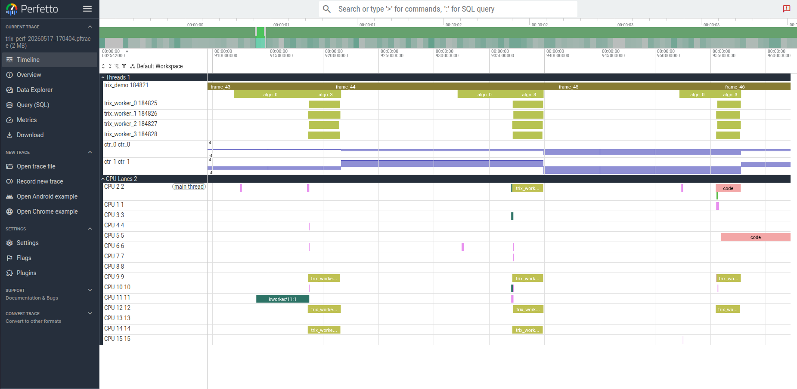
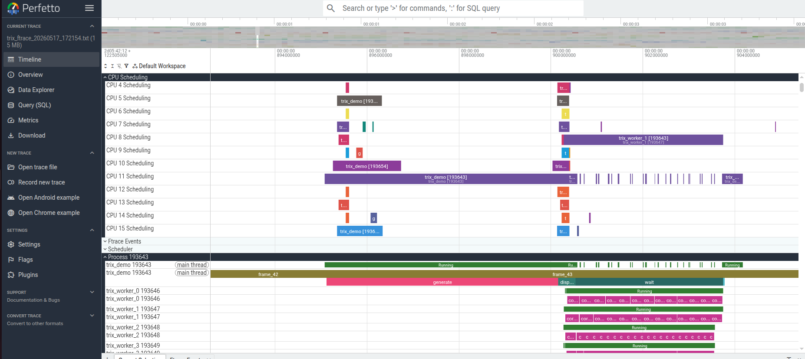

# trix Demo Walkthrough — Multithreaded Trace with Perfetto

A step-by-step guide: build trix and the demo, capture a full multithreaded
trace, and visualise it in Perfetto — with thread timelines, context switches,
per-CPU usage, and per-frame counters.

---

## Table of Contents

1. [What you need](#1-what-you-need)
2. [Build trix](#2-build-trix)
3. [Build the demo](#3-build-the-demo)
4. [Run without tracing (baseline)](#4-run-without-tracing-baseline)
5. [Capture a trace with ftrace](#5-capture-a-trace-with-ftrace)
6. [Capture a trace with perf](#6-capture-a-trace-with-perf)
7. [Capture a trace with LTTng](#6b-capture-a-trace-with-lttng)
8. [Open in Perfetto](#7-open-in-perfetto)
8. [Reading the trace — Timeline](#8-reading-the-trace--timeline)
9. [Reading the trace — CPU lanes](#9-reading-the-trace--cpu-lanes)
10. [Reading the trace — Counters](#10-reading-the-trace--counters)
11. [Troubleshooting](#11-troubleshooting)

---

## 1. What you need

### Required

| Package | Purpose | Install |
|---------|---------|---------|
| `cmake` ≥ 3.16 | Build system | `apt install cmake` |
| `gcc` / `g++` | C/C++ compiler | `apt install build-essential` |
| `libopencv-dev` ≥ 4 | Demo only — image warp + NCC | `apt install libopencv-dev` |

### Required for tracing

| Item | Purpose |
|------|---------|
| Root / sudo | Write access to tracefs (`/sys/kernel/tracing/`) |
| Kernel with `CONFIG_FTRACE=y` | Enables `/sys/kernel/tracing` — standard in all Ubuntu kernels |
| Browser with `https://ui.perfetto.dev` | Trace viewer (works offline after first load) |


---

## 2. Build trix

Clone (or enter) the repository and build the shared library with the **ftrace**
backend enabled (it is on by default on Linux):

```bash
git clone https://github.com/gooznick/trix.git
cd trix

cmake -B build
cmake --build build
```

Expected output:

```
-- Configuring done
-- Generating done
-- Build files have been written to: .../trix/build
...
[ 57%] Linking C shared library libtrix.so
[ 57%] Built target trix
[100%] Built target ...
```

The important artefact is `build/libtrix.so` (Linux) — the single shared library
containing all compiled backends.

### Verify

```bash
ls -lh build/libtrix.so
```

```
-rwxr-xr-x 1 user user  87K May 17 15:00 build/libtrix.so
```

---

## 3. Build the demo

The demo requires OpenCV and is built with `-DTRIX_BUILD_DEMO=ON`:

```bash
cmake -B build -DTRIX_BUILD_DEMO=ON
cmake --build build --target trix_demo
```

Expected output:

```
[100%] Linking CXX executable trix_demo
[100%] Built target trix_demo
```

The binary is at `build/demo/trix_demo`.

### What the demo does

The demo simulates a **50 Hz image-tracking pipeline** across 5 threads:

```
main thread (trix_demo)          worker threads (trix_worker_0 … trix_worker_3)
────────────────────────────────────────────────────────────────────────────────
TRIX_FRAME_SCOPE(N)              │
  generate   ← warpAffine        │
  dispatch   ── 70 patch tasks ──►  correlate × 70  (NCC template match)
  wait       ◄──────────────────────────────────────
  estimate   ← median translation
  sleep until next 20 ms tick
```

200 frames are processed, each instrumented with nested trix spans.

---

## 4. Run without tracing (baseline)

Before capturing, confirm the demo works:

```bash
export LD_LIBRARY_PATH=$PWD/build

./build/demo/trix_demo
```

Expected output:

```
trix demo  —  image tracking pipeline
  640x480 image, 70 patches, 4 workers, 50 Hz, 200 frames

  frame    0  est_t = (+2.00, +4.00) px
  frame   50  est_t = (+2.00, +2.00) px
  frame  100  est_t = (+1.00, -2.00) px
  frame  150  est_t = (+1.00, +4.00) px

Processed 200 frames in 4.02 s  (49.8 Hz avg)
Mean estimated translation: (0.050, 0.065) px
```

The mean translation is near zero — each frame's motion is random and independent.

---

## 5. Capture a trace with ftrace

Three scripts cover different workflows — all require root.

### All-in-one (simplest)

Starts tracing, runs the command, stops tracing, saves the file:

```bash
sudo sh ./scripts/capture_ftrace.sh ./build/demo/trix_demo
```

Expected output:

```
Using tracefs: /sys/kernel/tracing
Tracing started.
Running: ./build/demo/trix_demo
(Ctrl+C stops the command but tracing stays active.)

trix demo  —  image tracking pipeline
  ...
Processed 200 frames in 4.02 s  (49.8 Hz avg)

Command finished.  Tracing is still active.
Tracing stopped.

Trace saved: trix_ftrace_20260101_120000.txt  (4.2M, 89321 lines)

Open with Perfetto:
  Open https://ui.perfetto.dev → drag and drop trix_ftrace_20260101_120000.txt
```

### Pre / post (manual control)

Use this when you want to start tracing, run one or more commands (or kill
with Ctrl+C mid-run), and save later:

```bash
# 1. Start tracing and run the command.
#    Ctrl+C kills the command but tracing keeps going.
sudo sh ./scripts/capture_ftrace_pre.sh ./build/demo/trix_demo

# 2. (optional) Run additional instrumented commands while tracing is active.
#    sudo sh ./scripts/capture_ftrace_pre.sh ./myapp --some-flag

# 3. When ready, stop tracing and save.
sudo sh ./scripts/capture_ftrace_post.sh
```

`capture_ftrace_post.sh` uses `TRIX_FTRACE_OUT` to set the output filename;
defaults to `trix_ftrace_YYYYMMDD_HHMMSS.txt`.

### What the scripts do

```
pre:
  1. Locates tracefs  (/sys/kernel/tracing  or  /sys/kernel/debug/tracing)
  2. Clears the ring buffer, sets buffer to 8 MB per CPU (TRIX_BUFFER_KB)
  3. Enables: sched_switch, sched_wakeup, sched_migrate_task
  4. Starts tracing  (echo 1 > tracing_on)
  5. Runs the command  (Ctrl+C kills command, not tracing)
  6. Writes /tmp/trix_ftrace_state  (TRACE_DIR for post to use)

post:
  7. Stops tracing  (echo 0 > tracing_on)
  8. Saves cat /sys/kernel/tracing/trace → output file
  9. Disables sched events, removes state file
```

### Manual capture (step by step)

If you prefer not to use the scripts:

```bash
sudo -s

echo 8192 > /sys/kernel/tracing/buffer_size_kb
echo > /sys/kernel/tracing/trace
echo 1 > /sys/kernel/tracing/events/sched/sched_switch/enable
echo 1 > /sys/kernel/tracing/events/sched/sched_wakeup/enable
echo 1 > /sys/kernel/tracing/events/sched/sched_migrate_task/enable
echo 1 > /sys/kernel/tracing/tracing_on

TRIX_BACKEND=ftrace LD_LIBRARY_PATH=/path/to/trix/build \
    /path/to/trix/build/demo/trix_demo

echo 0 > /sys/kernel/tracing/tracing_on
cat /sys/kernel/tracing/trace > trix_ftrace.txt

echo 0 > /sys/kernel/tracing/events/sched/sched_switch/enable
echo 0 > /sys/kernel/tracing/events/sched/sched_wakeup/enable
echo 0 > /sys/kernel/tracing/events/sched/sched_migrate_task/enable
```

### Peek at the raw trace

```bash
head -30 trix_ftrace_*.txt
```

```
# tracer: nop
#
# entries-in-buffer/entries-written: 89321/89321   #P:16
#
#           TASK-PID     CPU#  ||||   TIMESTAMP  FUNCTION
#              | |         |   ||||      |         |
  trix_demo-12345 [003] ..... 1234.000010: tracing_mark_write: B|12345|frame_0
  trix_demo-12345 [003] ..... 1234.000015: tracing_mark_write: B|12345|generate
  trix_demo-12345 [003] ..... 1234.000280: tracing_mark_write: E|12345
trix_worker_0-12346 [001] ..... 1234.000322: tracing_mark_write: B|12345|correlate
...
```

`B|pid|name` = span begin, `E|pid` = span end (LIFO per thread).

---

## 6b. Capture a trace with LTTng

Use this path when you want **full string names** in spans.
LTTng-UST copies string values into the trace buffer at record time — no pointer
resolution needed.

**Userspace tracing does not require root.**
**Context switches (CPU lanes) require root + kernel modules** (see below).

### Install dependencies (once)

```bash
sudo apt install lttng-tools babeltrace2 liblttng-ust-dev

# For context switch / CPU lane data (optional, requires reboot or module reload):
sudo apt install lttng-modules-dkms
```

### Capture

The capture scripts follow the same pre/post pattern as ftrace.

**All-in-one (single run):**

```bash
# Userspace only (no root):
LD_LIBRARY_PATH=$PWD/build ./scripts/capture_lttng.sh ./build/demo/trix_demo

# With context switches (root + lttng-modules-dkms installed):
LD_LIBRARY_PATH=$PWD/build sudo ./scripts/capture_lttng.sh ./build/demo/trix_demo
```

**Multi-run (accumulate into one trace):**

```bash
# Start session and first run:
LD_LIBRARY_PATH=$PWD/build ./scripts/capture_lttng_pre.sh ./build/demo/trix_demo

# Run more commands (same session stays active):
LD_LIBRARY_PATH=$PWD/build TRIX_BACKEND=lttng ./build/demo/trix_demo

# Stop and export:
sh ./scripts/capture_lttng_post.sh
```

The script automatically enables kernel `sched_switch` if running as root and
the kernel modules are available, otherwise it continues with UST-only events
and prints a note.

Expected output:

```
  kernel sched_switch: enabled          # or "skipped" / "unavailable"
Recording './build/demo/trix_demo' with LTTng...
  session : trix_20260101_120000
  CTF dir : /tmp/trix_20260101_120000
[event recording ...]

Trace saved: trix_lttng_20260101_120000.txt  (3.5M, 49000 lines)

Convert to Perfetto:
  python3 scripts/lttng_to_perfetto.py trix_lttng_20260101_120000.txt \
    -o trix_lttng_20260101_120000.pftrace
  Open https://ui.perfetto.dev → drag and drop trix_lttng_20260101_120000.pftrace
```

### Convert to Perfetto format

```bash
python3 scripts/lttng_to_perfetto.py trix_lttng_20260101_120000.txt \
  -o trix_lttng_20260101_120000.pftrace
```

Span names are fully resolved (LTTng copies strings at record time):
`generate`, `dispatch`, `correlate`, `wait`, `estimate`, `est_tx`, `est_ty`.

### Manual capture (step by step)

```bash
lttng-sessiond --daemonize
lttng create my-session --output=/tmp/my-lttng
lttng enable-event -u 'trix:*'
lttng add-context -u -t vpid -t vtid -t procname
lttng start

LD_LIBRARY_PATH=$PWD/build TRIX_BACKEND=lttng ./build/demo/trix_demo

lttng stop
lttng destroy my-session

babeltrace2 /tmp/my-lttng > my_trace.txt
python3 scripts/lttng_to_perfetto.py my_trace.txt -o my_trace.pftrace
```

---

Use this path when ftrace is unavailable or when you prefer perf — for example
on embedded targets where only `perf` is installed.

**Requires root (or relaxed `perf_event_paranoid`).**

### Capture

The capture scripts follow the same pre/post pattern as ftrace.

**All-in-one (single run):**

```bash
LD_LIBRARY_PATH=$PWD/build sudo sh ./scripts/capture_perf.sh ./build/demo/trix_demo
```

**Pre/post split** (useful if you want to inspect the `.data` file first):

```bash
# Record:
LD_LIBRARY_PATH=$PWD/build sudo sh ./scripts/capture_perf_pre.sh ./build/demo/trix_demo

# Export to text:
sudo sh ./scripts/capture_perf_post.sh
```

The pre script:
1. Locates `libtrix.so` and registers the 7 trix SDT probes with perf
2. Records `sdt_trix:*` + `sched:sched_switch` events
3. Saves the `.data` file and prints the export hint

The post script:
1. Runs `perf script -F comm,tid,cpu,time,event,trace` to produce the text file
2. Prints the path and the Perfetto converter command

Expected output:

```
Registering SDT probes from: /home/user/trix/build/libtrix.so
  Probes registered.

Recording './build/demo/trix_demo' with perf...
  perf data : trix_perf_20260101_120000.data

[event recording ...]

Recording done.  Export the trace:
  sh ./scripts/capture_perf_post.sh

---

Exporting: trix_perf_20260101_120000.data → trix_perf_20260101_120000.txt

Trace saved: trix_perf_20260101_120000.txt  (3.0M, 49681 lines)

Convert to Perfetto:
  python3 scripts/perf_to_perfetto.py trix_perf_20260101_120000.txt \
    -o trix_perf_20260101_120000.pftrace
  Open https://ui.perfetto.dev → drag and drop trix_perf_20260101_120000.pftrace
```

### Convert to Perfetto format

```bash
python3 scripts/perf_to_perfetto.py trix_perf_20260101_120000.txt
```

The converter prints a legend mapping opaque span names to pointer values:

```
Algo span legend (same pointer = same algo within this run):
  algo_0        0x57a03c832105
  algo_1        0x57a03c83210e
  algo_2        0x57a03c83207f
  algo_3        0x57a03c832117
  algo_4        0x57a03c832089
  Resolve: strings <binary> | grep -i <keyword>
Counter legend:
  ctr_0         0x57a03c83211c
  ctr_1         0x57a03c832123
Written: trix_perf_20260101_120000.pftrace  (19834 events, 1949 KB)
```

> **Note — opaque names:** The perf backend records string pointers, not string
> content. All calls to the same function share the same pointer, so the
> grouping is correct — the spans just have generated names (`algo_0`, `algo_1`,
> …) instead of the original C strings. Use `strings build/demo/trix_demo` to
> identify which pointer maps to which name.

The output `.pftrace` is a standard Chrome trace JSON file. Proceed to
[§7 Open in Perfetto](#7-open-in-perfetto).

### Perfetto perf trace example



The **Threads** group shows trix spans (`frame_N`, `algo_0`…) on each thread row.
The **CPU Lanes** group (scroll down, expand with ▶) shows one row per CPU core
with context-switch bars — which thread ran on which core and for how long.

---

## 6c. Capture a trace with VTune (ITT backend)

Use this path for the richest view: **full string names**, **context switches**,
**CPU timeline**, **call stacks**, and **ITT metadata** — all in one result.
No conversion step needed; VTune opens its own result directory directly.

**Does not require root (uses user-mode sampling by default).**

### Install VTune (once)

Download the free Intel VTune Profiler:
<https://www.intel.com/content/www/us/en/developer/tools/oneapi/vtune-profiler.html>

Or install via oneAPI:

```bash
wget https://registrationcenter-download.intel.com/akdlm/IRC_NAS/.../l_BaseKit_...sh
sh l_BaseKit_...sh
```

The script auto-detects vtune from `PATH` or common install locations
(`~/intel/oneapi/vtune/*/bin64/vtune`, `/opt/intel/oneapi/vtune/...`).
You can also set `VTUNE_BIN=/path/to/vtune`.

### Capture

**All-in-one:**

```bash
LD_LIBRARY_PATH=$PWD/build ./scripts/capture_vtune.sh ./build/demo/trix_demo
```

> **Do not use `sudo`** — VTune threading analysis uses user-mode sampling and
> does not require root. Running with sudo strips `LD_LIBRARY_PATH`, causing
> `libtrix.so` to not be found.

**Pre/post split** (useful for inspecting the raw result before opening the GUI):

```bash
LD_LIBRARY_PATH=$PWD/build ./scripts/capture_vtune_pre.sh ./build/demo/trix_demo
# ... vtune collects ITT tasks + context switches + CPU samples ...
sh ./scripts/capture_vtune_post.sh
```

Expected output:

```
Using vtune: /home/user/intel/oneapi/vtune/2025.10/bin64/vtune
Collecting './build/demo/trix_demo' with VTune threading analysis...
  result dir : trix_vtune_20260101_120000

trix demo  —  image tracking pipeline
  ...
Processed 200 frames in 4.02 s  (49.8 Hz avg)

Collection done.  Open the results:
  sh ./scripts/capture_vtune_post.sh

Result saved: trix_vtune_20260101_120000/

Open in VTune GUI:
  vtune-gui trix_vtune_20260101_120000/trix_vtune_20260101_120000.vtune

Generate a text summary report:
  vtune -report summary -r trix_vtune_20260101_120000
  vtune -report top-down -r trix_vtune_20260101_120000
```

### What you see in VTune

The **threading** analysis type captures:

| Track | Contents |
|-------|----------|
| **Timeline** | ITT tasks (`generate`, `dispatch`, …) as colored spans per thread |
| **CPU Usage** | Per-core utilization over time |
| **Thread State** | Running / waiting / sleeping per thread with wait reason |
| **Context switches** | Which thread preempted which, on which CPU |
| **Metadata** | `data_int` / `data_float` / `data_string` values attached to tasks |
| **Call stacks** | CPU sampling — hottest functions within each span |

Open result: `vtune-gui trix_vtune_20260101_120000/trix_vtune_20260101_120000.vtune`

---


1. Open **[https://ui.perfetto.dev](https://ui.perfetto.dev)** in Chrome or Firefox
2. Click **"Open trace file"**
3. Drag and drop `demo/trix_trace.txt` (ftrace) or `*.pftrace` (perf / LTTng)

If the trace file is on a remote machine, copy it first:

```bash
scp user@target:~/trix/trix_perf_*.pftrace .
```

Perfetto loads the file locally in your browser — nothing is uploaded to a server.

### Air-gapped / offline networks

#### Option A — self-hosted static site (recommended)

Download once on a connected machine, then copy to any air-gapped host:

```bash
wget https://github.com/google/perfetto/releases/latest/download/ui.perfetto.dev.zip
unzip ui.perfetto.dev.zip -d perfetto-ui
# copy perfetto-ui/ to the air-gapped machine (USB, scp, etc.)

# On the air-gapped machine — serve from any directory:
cd perfetto-ui
python3 -m http.server 8080
# Open http://localhost:8080 in any browser
```

#### Option B — Docker

```bash
# On a connected machine:
docker pull patrickneid/perfetto-ui
docker save patrickneid/perfetto-ui | gzip > perfetto-ui.tar.gz

# Transfer perfetto-ui.tar.gz to the air-gapped machine, then:
docker load < perfetto-ui.tar.gz
docker run -p 8080:80 patrickneid/perfetto-ui
# Open http://localhost:8080
```



---

## 8. Reading the trace — Timeline

After loading, Perfetto shows a timeline with one row per thread and one row
per CPU.

### Overview


Zoom in on a few frames by scrolling the mouse wheel over the timeline, or by
pressing **W** / **S** to zoom in / out and **A** / **D** to pan.

### Main thread spans

Find the `trix_demo` row. Each **frame span** (named `frame_0`, `frame_1`, …)
is 20 ms wide at 50 Hz. Inside each frame you see four nested spans:

| Span | Thread | Meaning |
|------|--------|---------|
| `frame_N` | `trix_demo` | Entire frame budget (20 ms) |
| `generate` | `trix_demo` | `warpAffine` + Gaussian noise injection |
| `dispatch` | `trix_demo` | Pushing 70 tasks to the thread pool |
| `wait` | `trix_demo` | Main thread sleeping until all workers finish |
| `estimate` | `trix_demo` | Median translation from high-confidence patches |


Click any span to see its exact start time, duration, and depth in the details
panel at the bottom.

### Worker thread spans

The four `trix_worker_0` … `trix_worker_3` rows each show `correlate` spans —
one per patch (70 per frame, distributed across 4 threads).

Note how the `correlate` spans in the workers **overlap in time** with each
other, and with the main thread's `wait` span — this is the parallel section.


### Context switches inside a span

Inside a long `correlate` span you may see a gap — this is a kernel context
switch that preempted the thread. The scheduling events (`sched_switch`) make
these visible as breaks in the span.

To highlight context-switch points: in the **"Flow events"** panel, enable
**"sched_switch"**.


---

## 9. Reading the trace — CPU lanes

At the top of the trace Perfetto shows one **CPU lane** per logical core. Each
lane is a coloured bar showing which thread occupied that core at each moment.

### Which thread ran on which core

Scroll to the top of the trace. You will see `CPU 0`, `CPU 1`, … each showing a
solid-coloured timeline of thread activity.

- **`trix_demo`** (main thread) — typically pinned to one core during
  `generate` and `estimate`, but can migrate.
- **`trix_worker_0..3`** — spread across 4 cores by the Linux scheduler during
  the parallel `correlate` phase.
- **Idle** — grey gaps show when a core had no runnable thread.


### Zooming into one CPU

Click a CPU lane and zoom in with **W**. The bar becomes wide enough to show
the thread name. You can see:

- How long each thread held the core before being preempted or voluntarily
  sleeping
- Back-to-back `correlate` tasks on the same worker (the thread pool reuses the
  thread without a context switch between tasks)
- The main thread sleeping during `wait`, giving up its core to the OS


### How long each thread ran on each core

To get exact per-thread CPU time:

1. Press **Ctrl+F** (or click the search icon) and type `trix_worker_0`
2. Click **"Aggregate"** in the search results panel
3. Perfetto shows total wall time and CPU time for the selected thread

Alternatively, use the **"Thread state"** panel (bottom panel → "Thread state"):
select any thread and see a breakdown of time spent in Running / Sleeping /
Uninterruptible states.


---

## 10. Reading the trace — Counters

The trix demo emits two per-frame float counters:

| Counter | Meaning |
|---------|---------|
| `est_tx` | Estimated horizontal displacement (pixels) |
| `est_ty` | Estimated vertical displacement (pixels) |

In Perfetto these appear as **counter tracks** below the thread rows.


Each frame emits one sample. The value oscillates around zero (the random
warp has zero mean). Use the counter tracks to correlate algorithm output
with timing — for example, a large `est_tx` spike next to a long `correlate`
burst reveals frames where tracking was harder.

To see the counter values:

1. Click a counter track to select it
2. Click any data point in the track
3. The bottom panel shows the exact value and timestamp

---

## 11. Troubleshooting

### `trix: ftrace: cannot open trace_marker: Permission denied`

```
TRIX_BACKEND=ftrace ./build/demo/trix_demo
trix: ftrace: cannot open trace_marker: Permission denied
Aborted (core dumped)
```

**Cause:** `trace_marker` exists but your user does not have write permission.
This is the common case on a normal desktop — tracefs is mounted but restricted
to root.

```bash
# Option A — use the capture script (recommended, handles permissions for you)
sudo sh ./scripts/capture_ftrace.sh ./build/demo/trix_demo

# Option B — grant write access to your user for this session
sudo chmod o+w /sys/kernel/tracing/trace_marker
TRIX_BACKEND=ftrace LD_LIBRARY_PATH=$PWD/build ./build/demo/trix_demo

# Option C — run as root directly
sudo env TRIX_BACKEND=ftrace LD_LIBRARY_PATH=$PWD/build ./build/demo/trix_demo
```

If `trace_marker` does not exist at all (not just a permission issue):

```bash
# Check if tracefs is mounted
ls /sys/kernel/tracing/trace_marker

# If missing, mount it
sudo mount -t tracefs nodev /sys/kernel/tracing
```

---

### `Permission denied` running a capture script

```
./scripts/capture_perf.sh
bash: ./scripts/capture_perf.sh: Permission denied
```

The script is missing its execute bit.

```bash
chmod +x ./scripts/capture_perf.sh
./scripts/capture_perf.sh ./build/demo/trix_demo
```

---

### `sudo: ./scripts/capture_perf.sh: command not found`

`sudo` by default does not search relative paths. Use `sh` explicitly or an absolute path:

```bash
# Option A — pass to sh explicitly
sudo sh ./scripts/capture_perf.sh ./build/demo/trix_demo

# Option B — absolute path
sudo "$PWD/scripts/capture_perf.sh" ./build/demo/trix_demo
```

---

### `event syntax error: 'sdt_trix:algo_begin'` / `unknown tracepoint`

```
event syntax error: 'sdt_trix:algo_begin'
                     \___ unknown tracepoint
Hint: SDT event cannot be directly recorded on.
      Please first use 'perf probe sdt_trix:algo_begin' before recording it.
```

**Cause:** SDT probes must be registered with perf before they can be recorded.
The capture script now does this automatically, but if you see this error you
may be using an old version of the script or running `perf record` manually.

The script registers the probes for you — just run it as usual:

```bash
LD_LIBRARY_PATH=$PWD/build sudo sh ./scripts/capture_perf.sh ./build/demo/trix_demo
```

To register manually (one-time per build of `libtrix.so`):

```bash
sudo perf buildid-cache --add build/libtrix.so

sudo perf probe --add 'sdt_trix:algo_begin'
sudo perf probe --add 'sdt_trix:algo_end'
sudo perf probe --add 'sdt_trix:frame_begin'
sudo perf probe --add 'sdt_trix:frame_end'
sudo perf probe --add 'sdt_trix:data_int'
sudo perf probe --add 'sdt_trix:data_float'
sudo perf probe --add 'sdt_trix:data_string'
```

After rebuilding `libtrix.so`, delete and re-register the probes:

```bash
sudo perf probe --del 'sdt_trix:*'
# then re-add as above
```

---

### `ERROR: /path/to/build/demo/trix_demo not found`

The demo binary was not built.

```bash
cmake -B build -DTRIX_BUILD_DEMO=ON
cmake --build build --target trix_demo
ls build/demo/trix_demo
```

---

### `./build/demo/trix_demo: error while loading shared libraries: libtrix.so`

The runtime cannot find `libtrix.so`.

```bash
export LD_LIBRARY_PATH=$PWD/build
./build/demo/trix_demo
```

The capture script sets `LD_LIBRARY_PATH` automatically. For manual runs,
export it before executing the binary.

---

### `error while loading shared libraries: libopencv_core.so.4xx`

OpenCV shared libraries are not on the path.

```bash
# Ubuntu — install OpenCV
sudo apt install libopencv-dev

# Or, if installed to a custom prefix, add it
export LD_LIBRARY_PATH=/path/to/opencv/lib:$LD_LIBRARY_PATH
```

---

### Trace file is empty or has only header lines

The ring buffer may have been too small, or tracing was not active when the
demo ran.

```bash
# Check line count
wc -l demo/trix_trace.txt

# Increase buffer and re-capture
sudo sh -c 'echo 16384 > /sys/kernel/tracing/buffer_size_kb'
sudo sh ./scripts/capture_ftrace.sh ./build/demo/trix_demo
```

If the file has many lines but Perfetto shows nothing, check that the file
actually contains `tracing_mark_write` entries:

```bash
grep -c tracing_mark_write demo/trix_trace.txt
```

Should be thousands of lines. If zero, `TRIX_BACKEND=ftrace` was not set
when the demo ran — re-run the capture script.

---

### Perfetto shows `trix_demo` spans but no scheduling / CPU lanes

Scheduling events were not enabled before the capture.

```bash
# Check if sched_switch was captured in the trace file
grep -c sched_switch demo/trix_trace.txt
```

If zero, re-run the capture script (it enables `sched_switch`, `sched_wakeup`,
`sched_migrate_task`). Scheduling events require root.

---

### Trace is truncated — spans are cut off at the end

The ring buffer overflowed. Increase its size:

```bash
# In the capture script, or manually:
sudo sh -c 'echo 32768 > /sys/kernel/tracing/buffer_size_kb'
sudo sh ./scripts/capture_ftrace.sh ./build/demo/trix_demo
```

Check the buffer statistics in the trace header:

```
# entries-in-buffer/entries-written: 89321/89321
```

If both numbers are equal the buffer did **not** overflow. If `entries-written`
is larger, data was lost — increase the buffer size.

---

### `cmake: error: could not find OpenCV`

```bash
# Ubuntu
sudo apt install libopencv-dev

# Then re-run cmake
cmake -B build -DTRIX_BUILD_DEMO=ON
```

If OpenCV is installed to a non-standard prefix:

```bash
cmake -B build -DTRIX_BUILD_DEMO=ON \
      -DOpenCV_DIR=/path/to/opencv/lib/cmake/opencv4
```

---

### Perf output files are owned by root

When running the capture script with `sudo`, the `.data` and `.txt` files are
created by root.  The script automatically runs `chown` to restore ownership
to the invoking user (via `$SUDO_USER`).  If the files are still owned by root:

```bash
sudo chown $USER trix_perf_*.data trix_perf_*.txt
```

Then run the converter as your normal user:

```bash
python3 scripts/perf_to_perfetto.py trix_perf_*.txt
```

---

### The demo runs slower than 50 Hz (`~30 Hz avg`)

The 4 worker threads are doing real NCC template matching — on a slow machine
or a VM with few cores the workers cannot finish within 20 ms. This does **not**
affect the trace; it just means frames take longer than their budget. The trace
will show the `wait` span extending beyond the 20 ms deadline.

To speed things up, reduce the number of patches by increasing `GRID_STRIDE`
in `demo/demo.cpp`:

```cpp
static constexpr int GRID_STRIDE = 96;  // was 64 → fewer patches per frame
```

Then rebuild:

```bash
cmake --build build --target trix_demo
```
