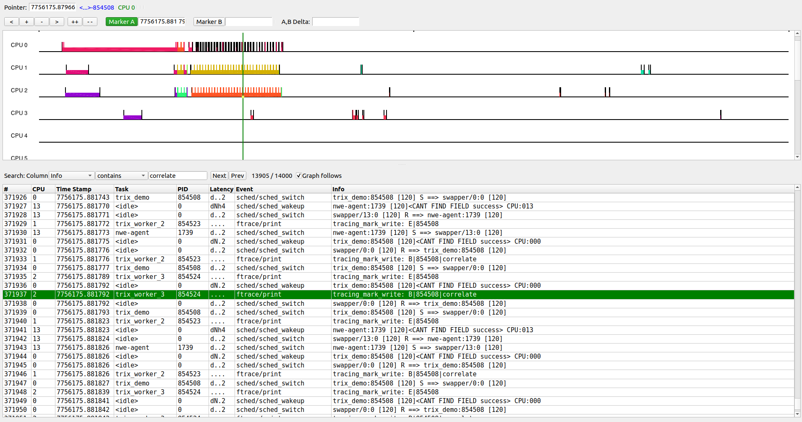

# KernelShark

KernelShark is a desktop GUI viewer purpose-built for ftrace data. It reads
`trace-cmd` `.dat` files natively — no conversion needed.

Compared to Perfetto:

| | KernelShark | Perfetto |
|---|---|---|
| Input | `.dat` (binary, native) | `.txt` (converted from `.dat`) |
| Runs | Local desktop app | Browser (online or self-hosted) |
| Strength | Deep ftrace integration, per-task / per-CPU plots, event filtering | Richer timeline UI, counter tracks, multi-format support |
| trix spans | Via `ftrace:print` events | Rendered as named duration spans |

Use KernelShark when you want to stay close to raw ftrace data — filtering by
task, CPU, or event type, or correlating scheduling with your own events.
Use Perfetto when you need a polished timeline with trix spans rendered as
named nested slices.

- [Build from source](#build-from-source)
- [Run](#run)
- [Open a trace](#open-a-trace)

---

## Build from source

The `apt` package (`sudo apt install kernelshark`) may segfault on non-KVM
traces. Build v2.2.1 from source instead.  
v2.2.1 uses **Qt5** — easier to satisfy on Ubuntu 22.04 than the Qt 6.3+
required by later releases.

### Build inside Docker (Ubuntu 22.04)

Build in a throwaway container and leave the output on the host:

```bash
mkdir -p ~/ks-build
docker run --rm -v ~/ks-build:/opt/ks ubuntu:22.04 bash -c "
set -e
apt-get update -qq
apt-get install -y \
  build-essential cmake pkg-config fonts-freefont-ttf \
  qtbase5-dev libqt5opengl5-dev \
  libtraceevent-dev libtracefs-dev libtracecmd-dev trace-cmd \
  libgl-dev freeglut3-dev libjson-c-dev curl

curl -sL https://git.kernel.org/pub/scm/utils/trace-cmd/kernel-shark.git/snapshot/kernel-shark-kernelshark-v2.2.1.tar.gz \
  -o /tmp/ks.tar.gz
cd /opt/ks
tar -xf /tmp/ks.tar.gz
cd kernel-shark-kernelshark-v2.2.1/build
cmake ..
make -j\$(nproc)
"
```

Binaries land in `~/ks-build/kernel-shark-kernelshark-v2.2.1/bin/`  
and libraries in `.../lib/`.

---

## Run

Install the Qt5 runtime libraries on the host if not already present:

```bash
sudo apt-get install -y libqt5widgets5 libqt5opengl5
```

Run with the build's `lib/` directory on the library path:

```bash
KS=~/ks-build/kernel-shark-kernelshark-v2.2.1
LD_LIBRARY_PATH=$KS/lib $KS/bin/kernelshark
```

---

## Open a trace

Pass the `.dat` file on the command line:

```bash
KS=~/ks-build/kernel-shark-kernelshark-v2.2.1
LD_LIBRARY_PATH=$KS/lib $KS/bin/kernelshark trace.dat
```

Or open it from inside KernelShark: **File → Open**.


