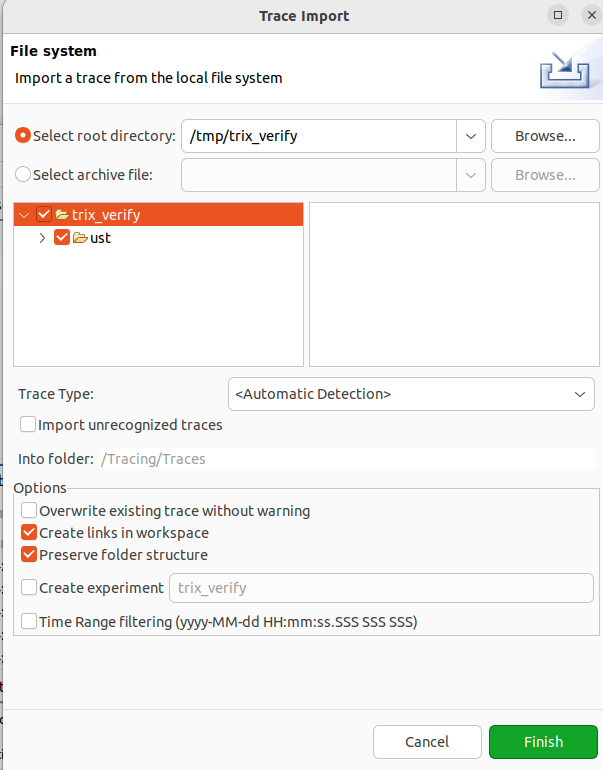
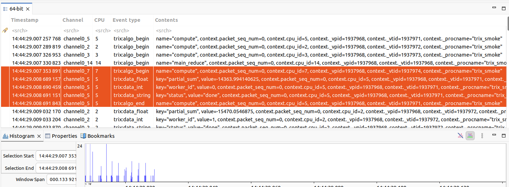
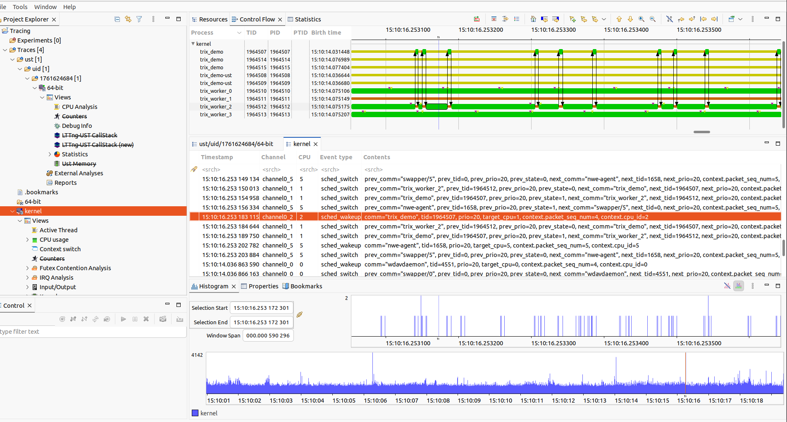

# Trace Compass

[Eclipse Trace Compass](https://eclipse.dev/tracecompass/) is a free, open-source
trace viewer for LTTng CTF traces (and many other formats). It is the reference
viewer for LTTng-captured trix sessions.

---

## Installation

Download the standalone RCP (no Eclipse IDE needed):

```bash
wget https://download.eclipse.org/tracecompass/releases/12.0.0/rcp/trace-compass-12.0.0-20260610-0816-linux.gtk.x86_64.tar.gz
tar xzf trace-compass-12.0.0-20260610-0816-linux.gtk.x86_64.tar.gz
cd trace-compass
./tracecompass
```

No install step — just extract and run. Requires a 64-bit JRE (bundled in the
RCP tarball).

---

## Opening an LTTng trace

After capturing with `capture_lttng_pre.sh` / `capture_lttng_post.sh`, import
the CTF directory:

```
File → Import → Tracing → Trace Import
Select root directory → /tmp/trix_session   (or the path from capture_lttng_post.sh output)
```

The **Events Editor** opens automatically and shows every trix tracepoint in
timestamp order, with fields (`name`, `vpid`, `vtid`, `procname`) in the detail
pane.



Selecting a `trix:algo_begin` / `trix:algo_end` pair and inspecting the detail
pane shows the span boundaries and all data fields:



---

## With kernel context-switch data

When the session also captured `sched_switch` / `sched_wakeup` (requires root +
`lttng-modules-dkms` — see [lttng.md](../backends/lttng.md#capture-with-context-switches)),
Trace Compass auto-creates an **experiment** merging the `kernel/` and `ust/`
sub-traces into a single timeline.

The **Control Flow** view shows per-thread scheduling lanes — when each thread
ran, on which CPU, and when it was preempted or woken:



Clicking any `trix:algo_begin` row in the Events Editor jumps the Control Flow
view to that exact timestamp, highlighting the owning thread lane.

---

## Pros and cons

### Pros

- **No extra conversion step** — opens LTTng CTF directories directly.
- **Time-synchronized views** — Events Editor, Control Flow, and Histogram all
  scroll together.
- **Kernel + user merged** — experiment view interleaves `sched_switch` and
  `trix:*` events by timestamp.
- **Filtering and bookmarks** — filter by event type, field value, or thread.

### Cons

- **No span visualisation for trix events** — `trix:algo_begin` / `trix:algo_end`
  pairs are shown as individual rows in the Events Editor, not as coloured bars
  on a timeline. Visualising them as spans requires a custom XML state analysis
  (not provided).
- **Kernel events required for timeline** — without `sched_switch`, the Control
  Flow view is empty. Pure UST traces show only the Events Editor table.
- **Heavy UI** — Trace Compass is a full Eclipse RCP application; startup takes
  a few seconds and large traces (> 100 MB CTF) need heap tuning
  (`tracecompass.ini`: `-Xmx2g`).

> For span-level visualisation of trix events, convert the babeltrace2 text
> export to Perfetto format:
> ```bash
> python3 scripts/lttng_to_perfetto.py trix_lttng.txt -o trix.pftrace
> ```
> Then open `trix.pftrace` in the [Perfetto UI](https://ui.perfetto.dev).
> See [lttng.md](../backends/lttng.md#convert-to-perfetto).
